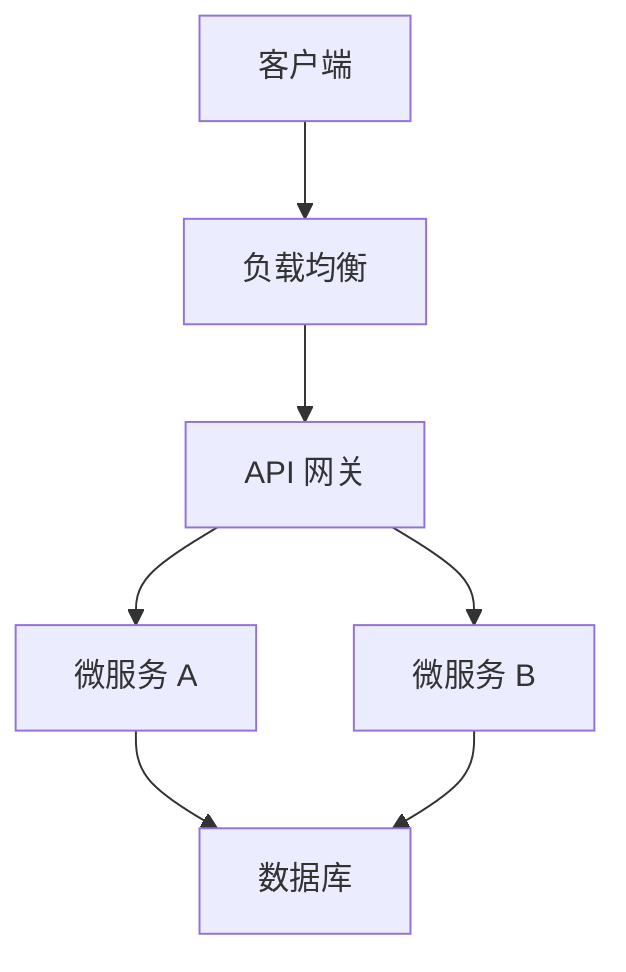
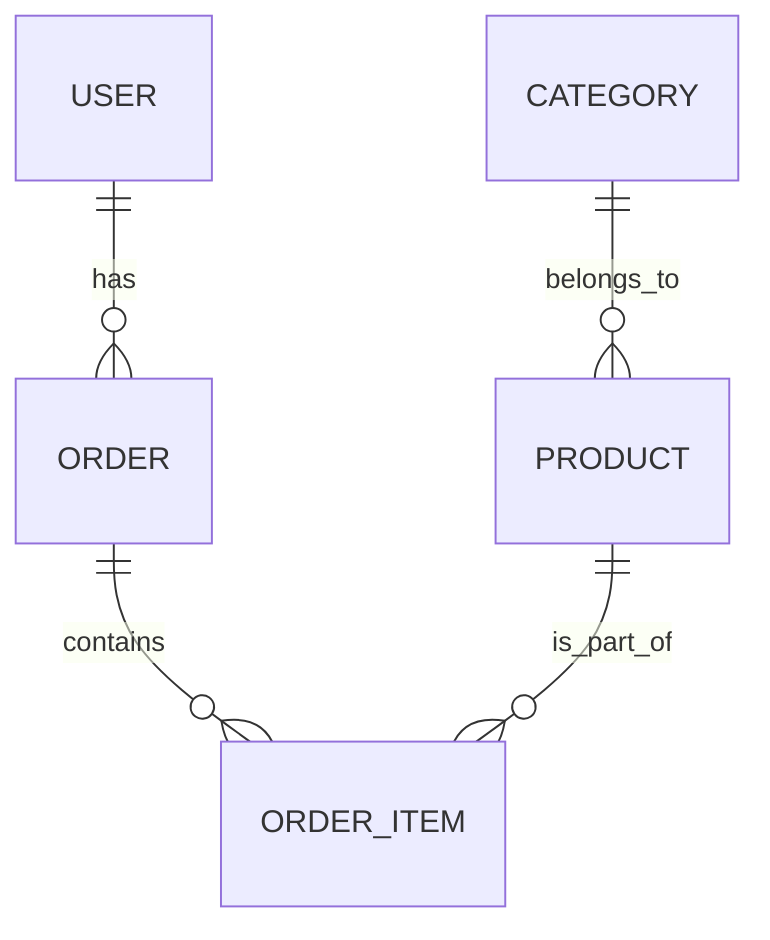

# 设计规范

## 1. 架构设计规范

### 1.1 架构设计原则
- **可扩展性**：系统设计应支持水平扩展
- **高可用性**：关键服务应有冗余和故障转移机制
- **安全性**：遵循安全最佳实践
- **可维护性**：代码结构清晰，易于理解和维护
- **性能**：优化系统性能，满足业务需求

### 1.2 架构设计文档模板

```markdown
# 架构设计文档

## 1. 系统概述
- 系统名称：
- 系统目标：
- 业务价值：

## 2. 架构选型
- **前端技术栈**：
- **后端技术栈**：
- **数据库**：
- **中间件**：
- **部署环境**：

## 3. 系统架构图



## 4. 核心模块

### 4.1 模块 1
- **功能描述**：
- **接口**：
- **依赖**：

### 4.2 模块 2
- **功能描述**：
- **接口**：
- **依赖**：

## 5. 数据流向
- **正常流程**：
- **异常流程**：

## 6. 技术风险
- **风险 1**：
- **应对措施**：

- **风险 2**：
- **应对措施**：

## 7. 部署策略
- **开发环境**：
- **测试环境**：
- **生产环境**：

## 8. 监控与告警
- **监控指标**：
- **告警策略**：

## 9. 变更管理
- **版本控制**：
- **发布流程**：

## 10. 附录
- **参考资料**：
- **术语定义**：
```

## 2. 数据模型设计规范

### 2.1 数据模型设计原则
- **范式化**：遵循数据库设计范式
- **性能优化**：合理设计索引
- **可扩展性**：支持未来业务增长
- **数据一致性**：确保数据完整性
- **安全性**：保护敏感数据

### 2.2 数据模型设计文档模板

```markdown
# 数据模型设计文档

## 1. 项目概述
- 项目名称：
- 业务领域：
- 设计目标：

## 2. 实体关系图



## 3. 数据表设计

### 3.1 表名：users
| 字段名 | 数据类型 | 约束 | 描述 |
|--------|---------|------|------|
| id | INT | PRIMARY KEY, AUTO_INCREMENT | 用户 ID |
| name | VARCHAR(50) | NOT NULL | 用户名 |
| email | VARCHAR(100) | UNIQUE, NOT NULL | 邮箱 |
| password_hash | VARCHAR(255) | NOT NULL | 密码哈希 |
| created_at | TIMESTAMP | DEFAULT CURRENT_TIMESTAMP | 创建时间 |
| updated_at | TIMESTAMP | DEFAULT CURRENT_TIMESTAMP ON UPDATE CURRENT_TIMESTAMP | 更新时间 |

### 3.2 表名：orders
| 字段名 | 数据类型 | 约束 | 描述 |
|--------|---------|------|------|
| id | INT | PRIMARY KEY, AUTO_INCREMENT | 订单 ID |
| user_id | INT | FOREIGN KEY (user_id) REFERENCES users(id) | 用户 ID |
| total_amount | DECIMAL(10,2) | NOT NULL | 总金额 |
| status | ENUM('pending', 'completed', 'cancelled') | DEFAULT 'pending' | 订单状态 |
| created_at | TIMESTAMP | DEFAULT CURRENT_TIMESTAMP | 创建时间 |
| updated_at | TIMESTAMP | DEFAULT CURRENT_TIMESTAMP ON UPDATE CURRENT_TIMESTAMP | 更新时间 |

## 4. 索引设计

| 表名 | 索引名 | 索引类型 | 字段 | 说明 |
|------|--------|---------|------|------|
| users | idx_email | UNIQUE | email | 加速邮箱查询 |
| orders | idx_user_id | INDEX | user_id | 加速用户订单查询 |

## 5. 数据迁移计划
- **迁移策略**：
- **回滚计划**：

## 6. 性能优化
- **查询优化**：
- **存储优化**：

## 7. 安全性考虑
- **敏感数据**：
- **访问控制**：

## 8. 附录
- **参考资料**：
- **术语定义**：
```

## 3. API 设计规范

### 3.1 API 设计原则
- **RESTful**：遵循 REST 设计风格
- **一致性**：API 设计风格一致
- **可读性**：接口命名清晰易懂
- **安全性**：实现适当的安全措施
- **可版本化**：支持 API 版本管理

### 3.2 API 设计文档模板

```markdown
# API 设计文档

## 1. 概述
- **API 版本**：v1
- **基础路径**：/api/v1
- **认证方式**：JWT

## 2. 接口列表

| 资源 | 方法 | 路径 | 模块 | 功能描述 |
|------|------|------|------|----------|
| 用户 | GET | /users | 用户管理 | 获取用户列表 |
| 用户 | GET | /users/{id} | 用户管理 | 获取用户详情 |
| 用户 | POST | /users | 用户管理 | 创建用户 |
| 用户 | PUT | /users/{id} | 用户管理 | 更新用户 |
| 用户 | DELETE | /users/{id} | 用户管理 | 删除用户 |

## 3. 接口详情

### 3.1 获取用户列表
- **请求**：
  - 方法：GET
  - 路径：/api/v1/users
  - 查询参数：
    - page: 页码，默认 1
    - limit: 每页数量，默认 10
    - sort: 排序字段

- **响应**：
  ```json
  {
    "code": 200,
    "message": "success",
    "data": {
      "items": [
        {
          "id": 1,
          "name": "John",
          "email": "john@example.com",
          "created_at": "2024-01-01T00:00:00Z"
        }
      ],
      "total": 100,
      "page": 1,
      "limit": 10
    }
  }
  ```

### 3.2 创建用户
- **请求**：
  - 方法：POST
  - 路径：/api/v1/users
  - 请求体：
    ```json
    {
      "name": "John",
      "email": "john@example.com",
      "password": "password123"
    }
    ```

- **响应**：
  ```json
  {
    "code": 201,
    "message": "success",
    "data": {
      "id": 1,
      "name": "John",
      "email": "john@example.com",
      "created_at": "2024-01-01T00:00:00Z"
    }
  }
  ```

## 4. 错误处理

| 错误码 | 描述 | 解决方案 |
|--------|------|----------|
| 400 | 请求参数错误 | 检查请求参数 |
| 401 | 未授权 | 提供有效的认证信息 |
| 403 | 禁止访问 | 检查权限 |
| 404 | 资源不存在 | 检查资源 ID |
| 500 | 服务器内部错误 | 联系管理员 |

## 5. 认证与授权
- **认证方式**：JWT
- **授权策略**：基于角色的访问控制

## 6. 速率限制
- **限制策略**：
- **响应头**：

## 7. 附录
- **参考资料**：
- **术语定义**：
```

## 4. 前端设计规范

### 4.1 前端设计原则
- **响应式设计**：适配不同设备
- **性能优化**：减少加载时间
- **可访问性**：符合 WCAG 标准
- **用户体验**：直观易用的界面
- **代码质量**：模块化、可维护的代码

### 4.2 前端设计文档模板

```markdown
# 前端设计文档

## 1. 项目概述
- **项目名称**：
- **设计目标**：
- **目标用户**：

## 2. 技术选型
- **框架**：
- **状态管理**：
- **UI 库**：
- **构建工具**：
- **测试工具**：

## 3. 页面设计

### 3.1 页面列表

| 页面名称 | 路径 | 模块 | 功能描述 |
|----------|------|------|----------|
| 首页 | / | 主页 | 展示系统概览 |
| 登录页 | /login | 认证 | 用户登录 |
| 注册页 | /register | 认证 | 用户注册 |
| 用户管理 | /users | 用户 | 管理用户信息 |

### 3.2 页面详情

#### 3.2.1 登录页
- **布局**：
- **组件**：
- **交互**：
- **响应式**：

## 4. 组件设计

### 4.1 组件列表

| 组件名称 | 路径 | 功能描述 |
|----------|------|----------|
| Button | components/Button | 按钮组件 |
| Input | components/Input | 输入框组件 |
| Card | components/Card | 卡片组件 |
| Table | components/Table | 表格组件 |

### 4.2 组件详情

#### 4.2.1 Button 组件
- **Props**：
  - type: 'primary' | 'secondary' | 'danger' | 'success'
  - size: 'small' | 'medium' | 'large'
  - disabled: boolean
  - onClick: function

- **示例**：
  ```jsx
  <Button type="primary" size="medium" onClick={handleClick}>
    提交
  </Button>
  ```

## 5. 状态管理
- **全局状态**：
- **局部状态**：
- **数据流**：

## 6. 路由设计
- **路由配置**：
- **权限控制**：

## 7. 性能优化
- **代码分割**：
- **懒加载**：
- **缓存策略**：

## 8. 测试策略
- **单元测试**：
- **集成测试**：
- **端到端测试**：

## 9. 部署策略
- **构建流程**：
- **部署环境**：

## 10. 附录
- **参考资料**：
- **术语定义**：
```

## 5. 代码规范

### 5.1 通用代码规范
- **命名规范**：
  - 文件命名：kebab-case
  - 组件/类命名：PascalCase
  - 变量命名：camelCase
  - 常量命名：UPPER_SNAKE_CASE

- **代码风格**：
  - 缩进：2 空格
  - 行长度：不超过 80 字符
  - 注释：JSDoc 格式
  - 空行：适当使用空行提高可读性

### 5.2 前端代码规范
- **React 规范**：
  - 使用函数组件
  - 使用 Hooks
  - 组件拆分合理
  - 状态管理清晰

- **CSS 规范**：
  - 使用 CSS Modules 或 styled-components
  - 命名规范：BEM
  - 避免使用 !important
  - 响应式设计

### 5.3 后端代码规范
- **Node.js 规范**：
  - 使用 async/await
  - 错误处理完善
  - 中间件使用合理
  - 路由组织清晰

- **数据库规范**：
  - SQL 语句规范
  - 事务使用合理
  - 索引设计优化
  - 连接池管理

## 6. 设计评审流程

### 6.1 评审准备
- **文档准备**：设计文档完整
- **评审材料**：相关资料齐全
- **参与人员**：相关角色到位

### 6.2 评审流程
1. **设计介绍**：设计者介绍设计方案
2. **问题讨论**：评审人员提出问题
3. **方案修改**：根据讨论结果修改方案
4. **最终确认**：确认设计方案

### 6.3 评审标准
- **完整性**：设计是否完整
- **可行性**：技术是否可行
- **安全性**：是否符合安全要求
- **性能**：是否满足性能要求
- **可维护性**：是否易于维护

### 6.4 输出产物
- **评审报告**：记录评审过程和结果
- **修改方案**：明确需要修改的内容
- **确认文档**：最终确认的设计文档
