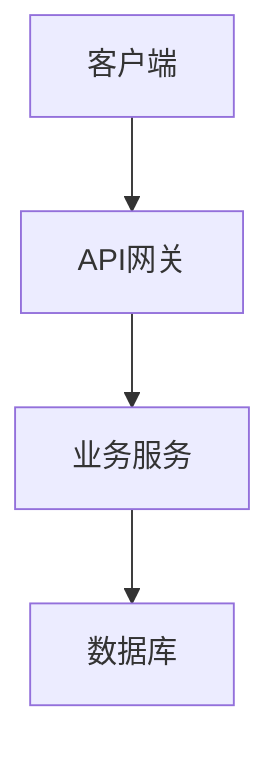
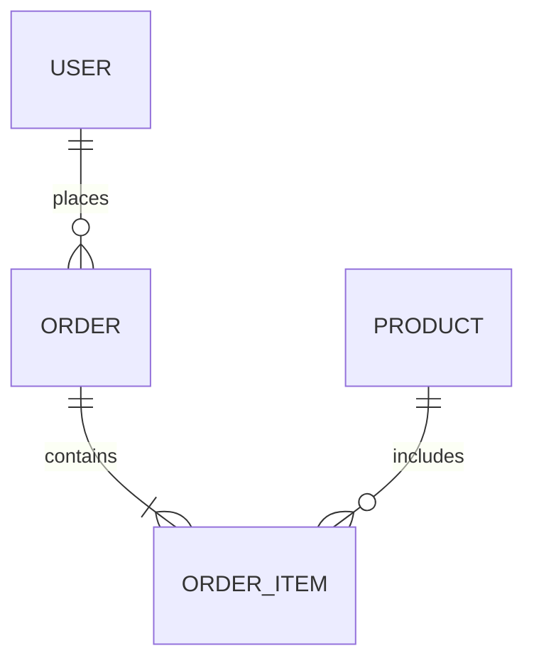

# 文档格式规范

## 1. 需求规约文档

**文件路径**: `design/project_overview/requirements_spec.md`

**格式示例**:

```markdown
# 项目需求规约

## 1. 项目概述
- 项目名称: xxx
- 项目目标: xxx
- 目标用户: xxx

## 2. 业务需求
- 需求1: xxx
- 需求2: xxx

## 3. 功能需求
- 功能1: xxx
- 功能2: xxx

## 4. 非功能需求
- 性能: xxx
- 安全: xxx
- 可用性: xxx

## 5. 范围
- 包含: xxx
- 不包含: xxx

## 6. 验收标准
- 标准1: xxx
- 标准2: xxx

## 7. 风险
- 风险1: xxx
- 风险2: xxx

## 8. 假设与约束
- 假设: xxx
- 约束: xxx
```

---

## 2. 特性需求文档

**文件路径**: `design/features/{feature-id}/requirements.md`

**要素范式**:

```markdown
# {特性名称} 需求规约

## 1. 特性概述
- 特性标识: {feature-id}
- 业务价值: xxx
- 优先级: 高/中/低
- 依赖特性: xxx

## 2. 用户故事
- 作为{角色}，我要{功能}，以便{价值}

## 3. 功能需求
- FR-{feature-id}-01: xxx
- FR-{feature-id}-02: xxx

## 4. 数据需求
- 数据实体: xxx
- 数据关系: xxx

## 5. 界面需求
- 页面布局: xxx
- 交互方式: xxx

## 6. 验收标准
- AC-{feature-id}-01: xxx
- AC-{feature-id}-02: xxx

## 7. 技术约束
- 性能要求: xxx
- 安全要求: xxx
- 兼容要求: xxx
```

---

## 3. 架构设计文档

**文件路径**:
- 后端: `design/project_overview/backend_architecture.md`
- 前端: `design/project_overview/frontend_architecture.md`

**格式示例**:

```markdown
# 架构设计

## 1. 技术栈选型
- 后端框架: xxx
- 数据库: xxx
- 前端框架: xxx
- 其他技术: xxx

## 2. 系统架构图


## 3. 模块划分
- 模块1: xxx
- 模块2: xxx

## 4. 核心流程
- 流程1: xxx
- 流程2: xxx

## 5. 关键设计决策
- 决策1: xxx (理由: xxx)
- 决策2: xxx (理由: xxx)

## 6. 非功能设计
- 性能: xxx
- 安全: xxx
- 可扩展性: xxx
```

---

## 4. 数据模型文档

**文件路径**: `design/project_overview/data_model.md`

**格式示例**:

```markdown
# 数据模型设计

## 1. 实体关系图


## 2. 表结构定义

### 2.1 用户表 (users)
| 字段名 | 类型 | 约束 | 说明 |
|--------|------|------|------|
| id | INT | PK | 用户ID |
| name | VARCHAR(100) | NOT NULL | 用户姓名 |
| email | VARCHAR(100) | UNIQUE | 邮箱 |
| created_at | TIMESTAMP | DEFAULT NOW() | 创建时间 |

### 2.2 其他表...

## 3. 索引设计
- 索引1: xxx
- 索引2: xxx

## 4. 数据迁移计划
- 迁移1: xxx
- 迁移2: xxx
```

---

## 5. API合同文档

**文件路径**:
- 总览: `design/project_overview/api_contracts.md`
- 特性API: `design/features/{feature-id}/api.md`

**格式示例**:

```markdown
# API 合同

## 1. 概述
- 基础URL: /api/v1
- 认证方式: JWT
- 数据格式: JSON

## 2. 接口列表

### 2.1 获取用户信息
- **Endpoint**: `GET /api/v1/users/{id}`
- **认证**: 需要
- **请求参数**:
  | 参数名 | 类型 | 必填 | 说明 |
  |--------|------|------|------|
  | id | INT | 是 | 用户ID |
- **响应示例 (200)**:
  ```json
  {
    "id": 1,
    "name": "张三",
    "email": "zhangsan@example.com"
  }
  ```
- **错误响应**:
  | 状态码 | 说明 |
  |--------|------|
  | 404 | 用户不存在 |

### 2.2 其他接口...
```

---

## 6. 项目计划文档

**文件路径**: `design/project_overview/project_plan.md`

**格式示例**:

```markdown
# 项目计划

## 1. 里程碑
| 里程碑 | 时间 | 交付物 |
|--------|------|--------|
| M1: 设计完成 | 2026-05-15 | 设计文档 |
| M2: 开发完成 | 2026-06-15 | 代码 |
| M3: 上线 | 2026-06-30 | 上线 |

## 2. 任务列表
- T1: 需求分析 (Team Lead)
- T2: 架构设计 (Architect)
- ...

## 3. 依赖关系
- T2 依赖 T1
- T3 依赖 T2

## 4. 资源分配
- Team Lead: 1人
- Architect: 1人
- ...
```

---

## 7. 任务文档

**文件路径**: `design/features/{feature-id}/tasks/{task-id}.md`

**格式示例**:

```markdown
# 任务: {任务名称}

## 1. 基本信息
- 任务ID: {task-id}
- 所属特性: {feature-id}
- 优先级: 高/中/低
- 预估工时: x小时
- 负责人: {Agent名称}

## 2. 任务描述
- 详细描述: xxx
- 验收标准: xxx

## 3. 依赖关系
- 前置任务: xxx
- 后置任务: xxx

## 4. 输入文档
- 文档1: xxx
- 文档2: xxx

## 5. 输出文档
- 文档1: xxx
- 文档2: xxx
```

---

## 8. 测试用例文档

**文件路径**: `design/features/{feature-id}/test-cases.md`

**格式示例**:

```markdown
# {特性名称} 测试用例

## 1. 测试计划
- 测试范围: xxx
- 测试策略: xxx

## 2. 测试用例列表

### TC-{feature-id}-001: {测试场景}
- **优先级**: 高/中/低
- **前置条件**: xxx
- **测试步骤**:
  1. 步骤1
  2. 步骤2
  3. 步骤3
- **预期结果**: xxx
- **实际结果**: (待执行)
- **状态**: 未执行/通过/失败

### TC-{feature-id}-002: ...

## 3. 自动化测试
- 测试文件: tests/unit/xxx.test.js
- 测试框架: xxx
```

---

## 9. 评审报告文档

**文件路径**: `design/project_overview/reviews/{review-type}-{timestamp}.md`

**格式示例**:

```markdown
# {评审类型} 报告

## 1. 基本信息
- 评审类型: 需求评审/设计评审/测试评审/代码评审
- 评审对象: xxx
- 评审时间: {timestamp}
- 评审人: {Agent名称}

## 2. 评审内容
- 内容1: xxx
- 内容2: xxx

## 3. 评审结果
- **总体结论**: 通过/不通过
- **迭代次数**: x/3

## 4. 问题列表
| 问题ID | 严重程度 | 问题描述 | 建议 | 状态 |
|--------|----------|----------|------|------|
| Q-001 | 高 | xxx | xxx | 待修复 |

## 5. 具体反馈
- 反馈1: xxx
  - 问题: xxx
  - 建议: xxx
  - 修改位置: xxx

## 6. 评审结论
- 是否通过: 是/否
- 原因: xxx
- 下一步: xxx
```

---

## 10. 反馈文档

**文件路径**: `design/project_overview/feedback/{source}-{target}-{timestamp}.json`

**格式示例**:

```json
{
  "timestamp": "2026-05-10T10:30:00Z",
  "source": "req-reviewer",
  "target": "team-lead",
  "type": "review-feedback",
  "review_type": "requirements",
  "status": "not-approved",
  "iteration": 1,
  "issues": [
    {
      "id": "Q-001",
      "severity": "high",
      "description": "需求描述不够清晰",
      "location": "requirements_spec.md:15",
      "suggestion": "请补充xxx细节"
    }
  ],
  "next_steps": "请根据问题列表修改需求文档"
}
```
