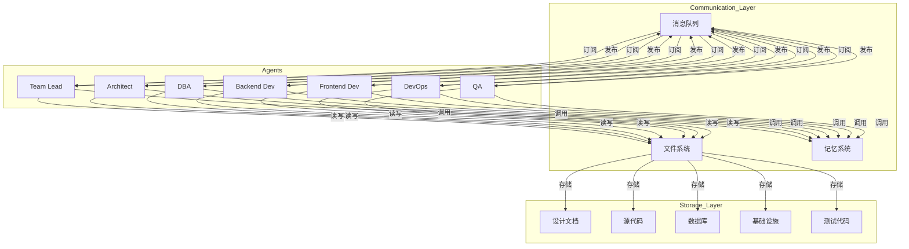

# 智能体通信机制设计文档

## 1. 通信渠道

### 1.1 主要通信渠道

| 通信渠道 | 用途 | 数据格式 | 协议 | 访问权限 |
|---------|------|---------|------|----------|
| 文件系统 | 主要信息传递 | Markdown/JSON | 文件读写 | 所有智能体可读写 |
| 记忆系统 | 状态持久化 | 结构化数据 | API调用 | 所有智能体可读写 |
| 消息队列 | 实时通知 | JSON | 发布/订阅 | 所有智能体可读写 |

### 1.2 详细说明

#### 文件系统通信
- **核心文件**：
  - `design/requirements_spec.md` - 需求规约文档
  - `design/project_plan.md` - 项目计划
  - `design/architecture.md` - 架构设计
  - `design/data_model.md` - 数据模型设计
  - `design/api_contracts.md` - API合同
  - `design/tasks/` - 任务文件目录

- **通信流程**：
  1. 源智能体生成文件
  2. 目标智能体读取文件
  3. 目标智能体生成新文件或更新现有文件

#### 记忆系统通信
- **核心功能**：
  - `saveProjectState` - 保存项目状态
  - `addTask` - 添加任务
  - `createSnapshot` - 创建状态快照
  - `addDecision` - 记录决策
  - `retrieveContext` - 检索上下文

- **通信流程**：
  1. 智能体调用记忆系统API
  2. 记忆系统存储/检索数据
  3. 其他智能体通过API获取数据

#### 消息队列通信
- **核心主题**：
  - `task-assigned` - 任务分配通知
  - `task-updated` - 任务状态更新
  - `review-requested` - 审核请求
  - `approval-granted` - 审批通过

- **通信流程**：
  1. 智能体发布消息到队列
  2. 订阅智能体接收消息
  3. 智能体根据消息执行相应操作

## 2. 状态管理

### 2.1 状态字段定义

| 实体 | 状态字段 | 可能值 | 描述 |
|------|---------|-------|------|
| 任务 | `status` | pending, in_progress, completed, blocked, cancelled | 任务当前状态 |
| 任务 | `progress` | 0-100 | 任务完成百分比 |
| 任务 | `priority` | high, medium, low | 任务优先级 |
| 文档 | `status` | draft, review, approved, rejected | 文档状态 |
| 项目 | `status` | planning, designing, developing, testing, deploying, completed | 项目状态 |
| 智能体 | `status` | idle, working, waiting, error | 智能体状态 |

### 2.2 状态转换规则

#### 任务状态转换
```
pending → in_progress → completed
        ↘ blocked → in_progress
        ↘ cancelled
```

#### 文档状态转换
```
draft → review → approved
      ↘ rejected → draft
```

### 2.3 状态通知机制
- 状态变更时自动发送消息到消息队列
- 相关智能体订阅状态变更消息
- 状态变更记录到记忆系统

## 3. 责任分配

### 3.1 智能体责任矩阵

| 智能体 | 核心职责 | 输入要求 | 处理功能 | 输出交付物 | 限制 |
|--------|---------|---------|---------|------------|------|
| Team Lead | 需求分析、任务拆解、全局协调 | 用户需求 | 需求分析、任务规划、协调管理 | 需求规约、项目计划、进度报告 | 不能直接修改业务代码 |
| Architect | 系统架构设计、技术选型 | 需求规约、项目计划 | 架构设计、技术选型、API设计 | 架构设计文档、API合同 | 不能修改数据库结构 |
| DBA | 数据库设计、SQL优化 | 架构设计、业务需求 | 数据模型设计、SQL优化 | 数据模型文档、SQL脚本 | 只能修改数据库相关内容 |
| Backend Dev | 后端业务逻辑开发 | 架构设计、API合同、数据模型 | API实现、业务逻辑、数据库操作 | 后端代码、测试用例 | 不能修改依赖配置 |
| Frontend Dev | 前端界面开发 | 架构设计、API合同 | UI组件、用户交互、状态管理 | 前端代码、测试用例 | 不能修改依赖配置 |
| DevOps | 环境配置、CI/CD流程 | 架构设计、项目计划 | 环境配置、部署脚本、CI/CD配置 | 部署配置、CI/CD流程 | 可以修改依赖配置 |
| QA | 测试用例设计、测试执行 | 需求规约、API合同 | 测试计划、测试执行、缺陷管理 | 测试报告、缺陷记录 | 不能修改业务代码 |

### 3.2 任务分配策略
- **基于技能匹配**：根据智能体的核心职责分配任务
- **基于负载均衡**：考虑智能体当前工作负载
- **基于依赖关系**：确保任务按正确顺序分配
- **基于优先级**：优先分配高优先级任务

## 4. 文件存储架构

### 4.1 目录结构

```
project/
├── design/                # 设计文档目录
│   ├── requirements_spec.md    # 需求规约文档
│   ├── project_plan.md         # 项目计划
│   ├── architecture.md         # 架构设计
│   ├── data_model.md           # 数据模型设计
│   ├── api_contracts.md        # API合同
│   └── tasks/                  # 任务文件目录
│       ├── T001_*.md           # 任务1
│       ├── T002_*.md           # 任务2
│       └── ...
├── src/                   # 源代码目录
│   ├── client/              # 前端代码
│   └── server/              # 后端代码
├── database/              # 数据库相关
│   ├── schema/               # 数据库 schema
│   └── migrations/           # 数据库迁移
├── infra/                 # 基础设施
│   ├── ci/                   # CI配置
│   └── deployment/           # 部署配置
├── tests/                 # 测试代码
│   ├── unit/                 # 单元测试
│   ├── integration/          # 集成测试
│   └── e2e/                  # 端到端测试
└── .trae/                # TRAE配置
    ├── agents/               # 智能体配置
    ├── skills/               # 技能配置
    ├── core/                 # 核心功能
    └── memory/               # 记忆系统
```

### 4.2 命名规范

| 文件类型 | 命名规范 | 示例 |
|---------|---------|------|
| 需求规约 | `requirements_spec.md` | - |
| 项目计划 | `project_plan.md` | - |
| 架构设计 | `architecture.md` | - |
| 数据模型 | `data_model.md` | - |
| API合同 | `api_contracts.md` | - |
| 任务文件 | `{task_id}_{task_name}.md` | `T001_requirement_analysis.md` |
| 源代码 | 遵循语言规范 | `user_service.js` |
| 测试文件 | `{source_file}_test.{ext}` | `user_service_test.js` |

### 4.3 版本控制
- 所有文件纳入Git版本控制
- 遵循GitFlow分支管理策略
- 提交消息遵循约定式提交规范
- 定期创建版本标签

## 5. 格式规范

### 5.1 文档格式规范

#### 需求规约文档
```markdown
# 需求规约文档

## 1. 业务需求
- 业务需求1
- 业务需求2

## 2. 功能需求
- 功能需求1
- 功能需求2

## 3. 非功能需求
- 非功能需求1
- 非功能需求2

## 4. 范围
范围描述

## 5. 验收标准
- 验收标准1
- 验收标准2

## 6. 风险
- 风险1
- 风险2
```

#### 架构设计文档
```markdown
# 架构设计文档

## 1. 技术栈
- 前端：技术栈
- 后端：技术栈
- 数据库：技术栈
- 云服务：技术栈

## 2. 系统架构
- 系统分层
- 模块划分
- 核心流程

## 3. 数据流
数据流描述

## 4. 可扩展性
可扩展性设计

## 5. 安全性
安全措施
```

#### 任务文件
```markdown
# 任务详情

## 基本信息
- 任务ID: {task_id}
- 任务名称: {task_name}
- 负责人: {assignee}
- 优先级: {priority}
- 预计工时: {hours} 小时
- 任务状态: {status}
- 进度: {progress}%

## 任务描述
任务描述

## 依赖关系
- 依赖任务: {dependencies}
- 依赖任务详情:
  - {dep_id}. {dep_name} (负责人: {dep_assignee})

## 验收标准
- 标准1
- 标准2

## 相关文档
- 文档1
- 文档2

## 变更记录
| 日期 | 变更内容 | 变更人 |
|------|----------|--------|
| {date} | 任务创建 | System |
```

### 5.2 数据格式规范

#### 任务数据结构
```json
{
  "id": "T001",
  "name": "需求分析",
  "assignee": "Team Lead",
  "priority": "high",
  "estimated_hours": 8,
  "status": "pending",
  "progress": 0,
  "dependencies": [],
  "created_at": "2026-04-19T00:00:00Z",
  "updated_at": "2026-04-19T00:00:00Z"
}
```

#### 消息格式
```json
{
  "type": "task-assigned",
  "timestamp": "2026-04-19T00:00:00Z",
  "sender": "team-lead",
  "recipient": "architect",
  "data": {
    "task_id": "T002",
    "task_name": "架构设计",
    "deadline": "2026-04-30"
  }
}
```

## 6. 行业最佳实践集成

### 6.1 微服务架构模式
- **服务拆分**：按功能域拆分服务
- **API网关**：统一入口，路由管理
- **服务发现**：自动注册和发现服务
- **负载均衡**：分发请求，提高可用性

### 6.2 事件驱动通信模型
- **发布/订阅模式**：解耦智能体间通信
- **事件溯源**：记录所有状态变更
- **CQRS**：命令查询责任分离

### 6.3 分布式系统设计原则
- **CAP理论**：在一致性、可用性和分区容错性之间权衡
- **最终一致性**：确保系统最终达到一致状态
- **幂等性**：确保操作重复执行不会产生副作用
- **熔断机制**：防止级联故障

### 6.4 DevOps最佳实践
- **CI/CD**：持续集成和持续部署
- **基础设施即代码**：使用代码管理基础设施
- **监控告警**：实时监控系统状态
- **自动化测试**：确保代码质量

## 7. 改进建议

### 7.1 通信机制改进
- **标准化API**：为所有智能体提供统一的通信API
- **消息验证**：实现消息格式验证，确保数据一致性
- **错误处理**：完善错误处理机制，提高系统可靠性
- **重试机制**：实现消息传递的重试机制，确保消息不丢失

### 7.2 状态管理改进
- **状态可视化**：提供任务状态和项目进度的可视化界面
- **状态预测**：基于历史数据预测任务完成时间
- **异常检测**：自动检测任务延期和异常状态

### 7.3 性能优化
- **缓存机制**：缓存频繁访问的数据，提高响应速度
- **异步处理**：将耗时操作异步化，提高系统吞吐量
- **负载均衡**：合理分配智能体工作负载，避免瓶颈

### 7.4 安全性增强
- **访问控制**：实现细粒度的访问控制，保护敏感数据
- **加密传输**：对所有通信进行加密，防止数据泄露
- **审计日志**：记录所有操作，便于追溯和审计

### 7.5 可扩展性提升
- **模块化设计**：采用模块化设计，便于添加新智能体
- **插件系统**：实现插件机制，支持功能扩展
- **容器化部署**：使用容器化技术，提高部署灵活性

## 8. 实施指南

### 8.1 初始化步骤
1. 配置智能体通信渠道
2. 设置文件存储架构
3. 初始化记忆系统
4. 配置消息队列

### 8.2 智能体注册
1. 定义智能体配置文件
2. 注册智能体到系统
3. 配置智能体权限
4. 测试智能体通信

### 8.3 工作流程实施
1. 定义项目工作流程
2. 配置任务模板
3. 设置状态转换规则
4. 测试完整工作流程

### 8.4 监控与维护
1. 监控智能体状态
2. 监控通信渠道
3. 定期备份数据
4. 处理异常情况

## 9. 架构图



## 10. 总结

本设计文档提供了一个全面的智能体通信机制，涵盖了通信渠道、状态管理、责任分配、文件存储架构、格式规范、行业最佳实践集成和改进建议等七个关键组件。通过实施此设计，可以实现智能体之间的无缝通信和协作，提高项目开发效率和质量。

该设计采用了文件系统、记忆系统和消息队列三种通信渠道，确保了信息的可靠传递和状态的持久化。同时，通过明确的状态管理和责任分配，确保了任务的有序执行和智能体的高效协作。

此外，该设计集成了微服务架构模式、事件驱动通信模型和分布式系统设计原则等行业最佳实践，为智能体系统的可扩展性、可靠性和性能提供了保障。

通过持续改进和优化，此通信机制可以适应不断变化的项目需求，为智能体系统的长期发展奠定基础。
